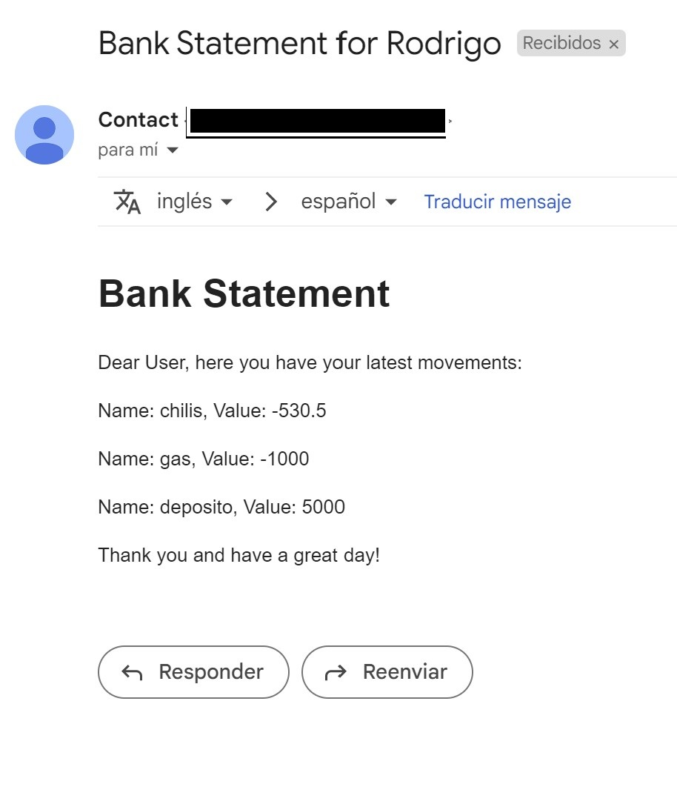

# Challenge-API-Go

# Gin and mongo API Bank App

This project replicates my repository of "Challenge-API" https://github.com/rodblg/Challenge-API but insted of using python, fastAPI and PostgreSQL, here I implement an API with Go, gin and mongo as database. 
It allows you to create a new account for an user, log in with your credentials, make transactions, see all your movements inside the "app" and then send a report by email with your latests movements.

## Features
- Signup and Login with email/password, JWT authorization
- Make a registry of transactions in your user account that will be saved in a mongo collection
- Summarize your transaction movements using a mongo aggregation pipeline and send a report by email

## Technologies Used
- Go/Golang
- mongo
- gin

## Installation and Configuration Instructions
1. Clone the github repository
2. Generate the .env file with all your personal credentials
3. You can run the gin API project inside the root directory with: `go run main.go`

Inside your .env file you will have to generate your env variables like this:
```
Sender="email@gmail.com"
Password="email credentials"
SMTPHost="smtp.gmail.com"
SMTPPort=465
MONGO_URI=mongodb://localhost:27017
PORT="8000"

```

## Path Operations

This project has 6 path operations for both users and transactions:


- /users/signup: This endpoint allows you to create new user accounts. Requires a JSON object as an input. The format for the object is as follows: 
``` 
{ 
    "first_name":"user_first_name",
    "email":"user_email@email.com",
    "password":"userpassword",
    "phone":"537072836"
} 
``` 
- /users/login: This endpoint allows you to log into an existing account with your username and password credentials.
The endpoint for logging into an existing account requires a JSON object as an input. The format for the object is as follows:
```
{
    "email":"user_email@email.com",
    "password":"userpassword"   
}
```
This will generate a token that will authorize the following path operations and must be provided as a header.

- /transactions: This endpoint allows you to create a new transaction and store it inside a mongo collection. Requires a JSON object as an input. The format for the object is shown in the following example:
```
{
    "value": -1002.25,
    "name_movement":"gasolina"
}
```
In case the value is negative represents a credit movement, in case is positive represents a debit movement. 

- /transactions: This endpoint retrieves all user movements.
- /users/user: This endpoint retrieves a JSON with all user information stored in a mongo collection along all user transactions, current balance and total count of movements. 

- /users/statement: This endpoint generates an email to the user contact information with all the user movements stored in the mongo collection

## Final result
After signup as an user, login, make some transaction movements you will get a similar message at the email provided at the signup stage. 




## Postman configuration
You can use the postman collection to make new requests into the API following this steps:
1. Download file inside Postman folder.
2. Import it into your workspace.
3. To run and test the collection use the following URI structure  `http://127.0.0.1:8000/{path_operation}`.

